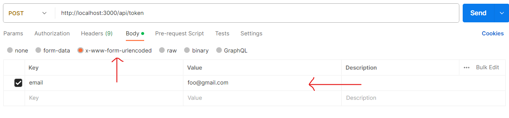
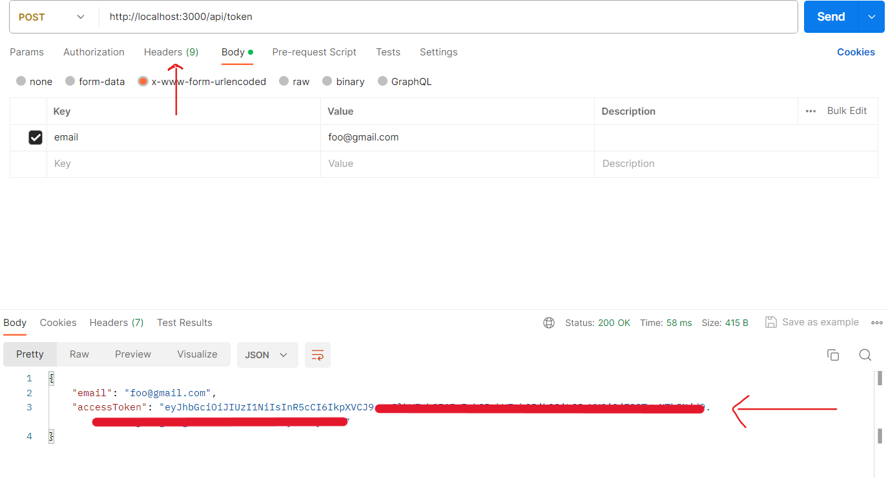
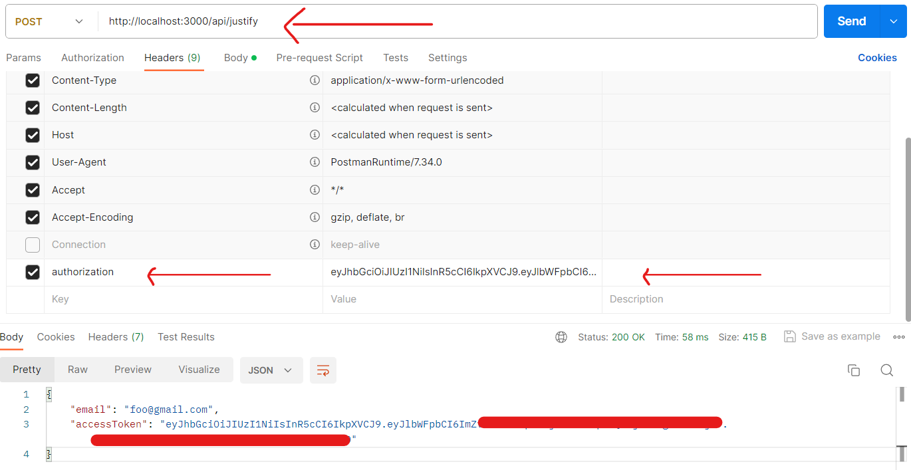
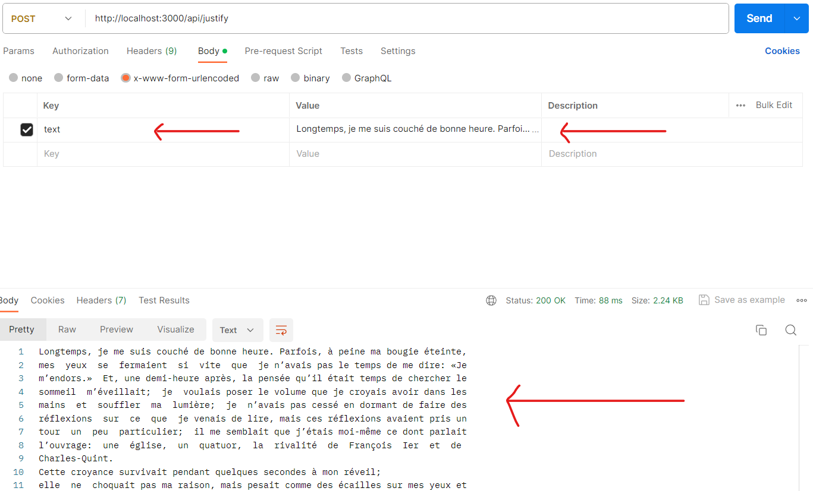

# Justify-API

API to justify text to 80 caracters maximum per line.
You have a rate limit of 8000 words per day for free.

## Table of Contents

- [Prerequisites](#prerequisites)
- [General overview](#General-overview)
- [Step by step](#step-by-step)

## Prerequisites

List any software, libraries, or tools that users need to have installed before they can use your project.

- Prerequisite: You need to have a software that can test API (ex: postman).

## General overview

Here is the api url you can use:
You have 2 routes :

- "api/token": To retrieve the token that is needed to call "api/justify":

  - need a key-value in the body => key = email, value= "your-email"

- "api/justify : once the token is retrieve with "api/token":
  - add the key-value in the headers => key = authorization, value = "your-token-just-generated"
  - add the key-value in the body => key = text, value = "your-text-you-want-to-justify"

## Step by Step

Here is the api url you can use:
You have 2 routes :

- "api/token"
- "api/justify

Step 1 :

- add in the body, a key-value => email: "foo@gmail.com"
- select x-www-form-urlencoded
- click "send"

Step 2 :

- You will receive a json with your email and a token.
- Copy the token
- Go to the headers section

Step 3 :

- add in the headers, a key-value => authorization: "your-token-just-copied"
- Once it's done change your route to : /api/justify

- go back to the body and add a key-value => text: "your-text-that-you-want-to-justify"
- click send et voila ! you have your text justified.

